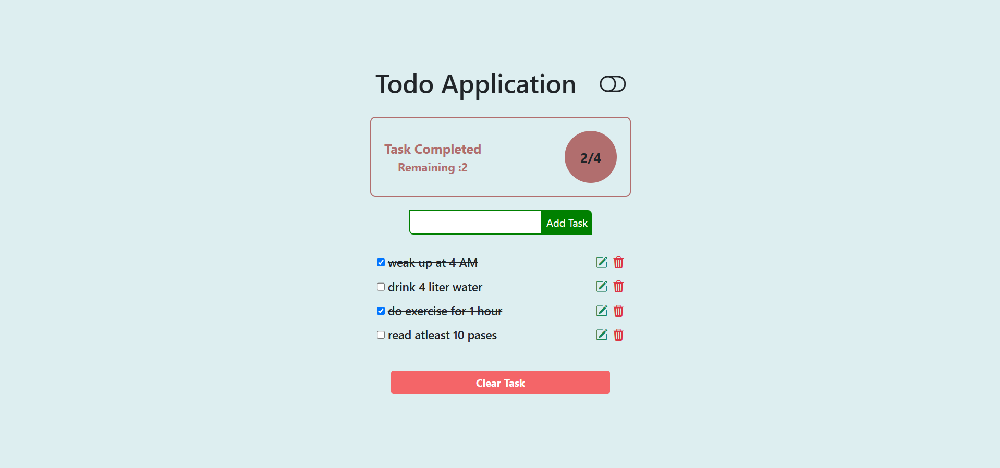
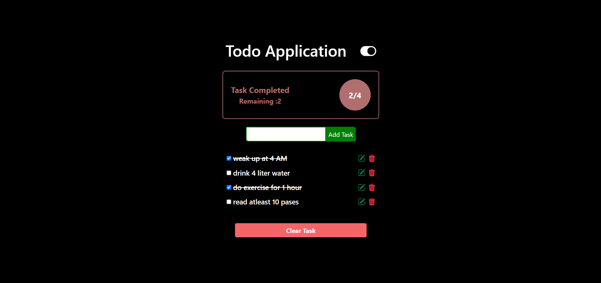

# My Todo App - A React Todo Application

A simple yet effective Todo List application built with React, designed to help you manage your daily tasks efficiently. It provides a clean interface, persistent storage, and helpful notifications to keep your tasks organized.

---

## ✨ Features

* **Add Tasks:** Quickly add new tasks to your list.
* **Mark as Complete:** Mark tasks as completed to track your progress.
* **Edit Tasks:** Update existing tasks with new details.
* **Delete Tasks:** Remove individual tasks from your list.
* **Clear All Tasks:** Clear all tasks with a single click.
* **Persistent Storage:** Your tasks are saved locally in your browser's local storage, so they persist even after closing and reopening the browser.
* **Task Summary:** Displays a summary of completed, remaining, and total tasks.
* **Responsive Design:** Adapts to various screen sizes for a seamless experience on different devices.
* **Notifications:** Provides helpful toast notifications for task additions, updates, and deletions.
* **Dark Mode Toggle:** Switch between light and dark themes for better readability and user preference.
* **Duplicate Task Prevention:** Prevents adding the same task twice.

---

## 🚀 Technologies Used

* **React:** A JavaScript library for building user interfaces.
* **React Hot Toast:** A popular library for beautiful and responsive toast notifications.
* **CSS Modules:** For component-scoped styling, preventing style conflicts.
* **Local Storage API:** For client-side data persistence.
* **Vite (implied by `npm start` and modern React setup):** A fast build tool.
* **Bootstrap Icons (implied by `bi bi-trash3-fill`, `bi bi-pencil-square`, `bi bi-toggle-off` classes):** Used for icons. *You'll need to ensure Bootstrap Icons are linked in your `index.html` or installed and imported if they are not already.*

---

## 📦 Installation

To get a local copy of the project up and running on your machine, follow these simple steps:

1.  **Clone the repository:**
    ```bash
    git clone https://github.com/sibun77/MyTodo-App.git
    cd MyTodo-App
    ```
2.  **Install NPM packages:**
    ```bash
    npm install
    # or
    yarn install
    ```
3.  **Run the development server:**
    ```bash
    npm start
    # or
    yarn start
    ```
    This will start the app in development mode, typically accessible at `http://localhost:3000` (or another available port).

---

## 💡 Usage

1.  **Add a Task:** Type your task in the input field and click "Add Task" or press `Enter`.
2.  **Mark as Complete:** Click the **checkbox** next to a task to toggle its completion status. Completed tasks will be crossed out.
3.  **Edit a Task:** Click the **pencil icon** (✏️) next to a task to update its text. A prompt will appear allowing you to enter the new task.
4.  **Delete a Task:** Click the **trash icon** (🗑️) next to a task to remove it from the list.
5.  **Clear All Tasks:** Click the "Clear Task" button at the bottom to remove all tasks from the list.
6.  **Toggle Dark Mode:** Click the **toggle icon** (🔘) in the header to switch between light and dark themes.

---

## 📸 Screenshots

*(Optional: Add screenshots or GIFs here to showcase your application. For example:)*


*A screenshot showing tasks being added and completed.*


*A screenshot showing the dark mode in action.*


---

## 🤝 Contributing

Contributions are always welcome! If you have suggestions for improvements, new features, or bug fixes, feel free to open an issue or submit a pull request.

1.  Fork the Project
2.  Create your Feature Branch (`git checkout -b feature/AmazingFeature`)
3.  Commit your Changes (`git commit -m 'Add some AmazingFeature'`)
4.  Push to the Branch (`git push origin feature/AmazingFeature`)
5.  Open a Pull Request

---

## 📄 License

Distributed under the MIT License. See `LICENSE` for more information.

---

## 📧 Contact

Shibabrata Jena - [shibabrataj7@gmail.com](mailto:shibabrataj7@gmail.com)

Project Link: [https://my-todo-app-three-zeta.vercel.app/](https://my-todo-app-three-zeta.vercel.app/)
